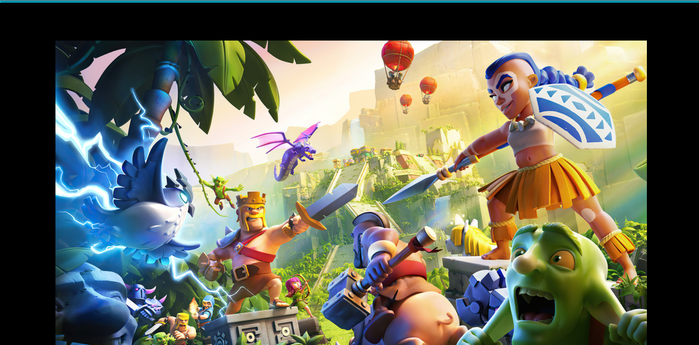
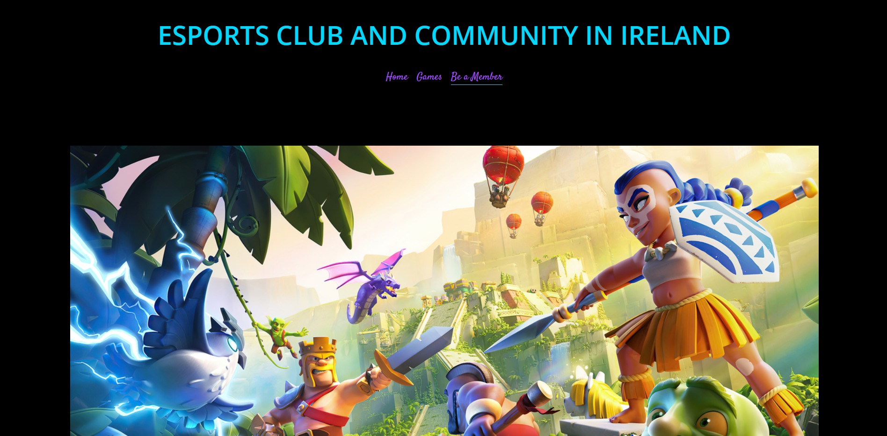
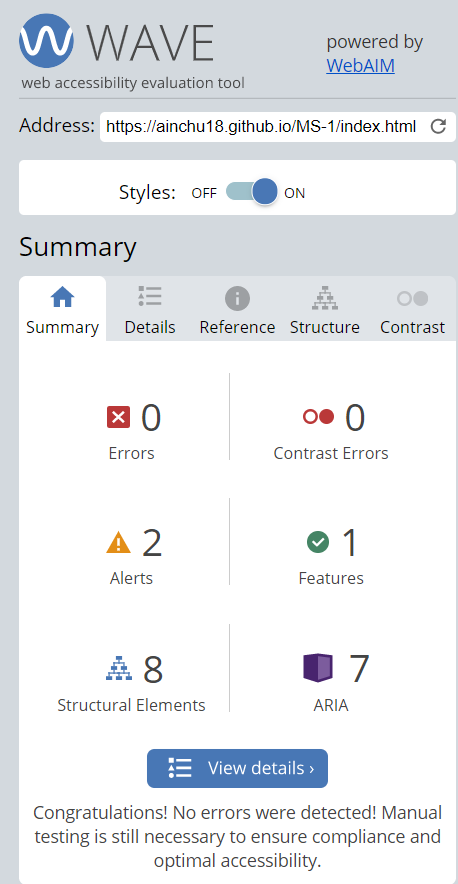
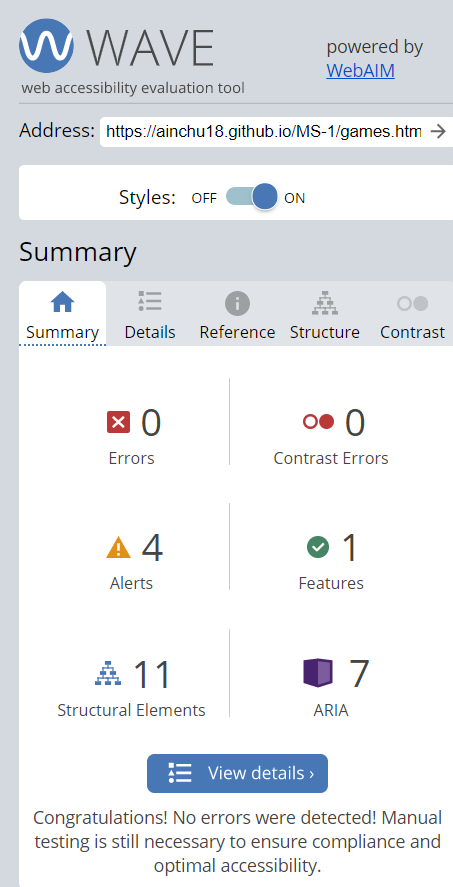
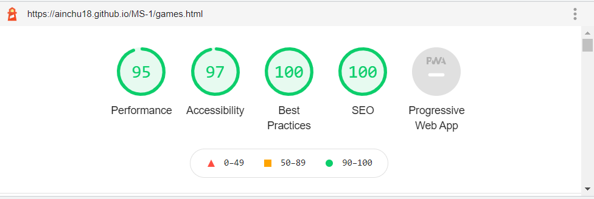

# Gamers for Life
---
Developer: CCJK

[Go to the website](https://ainchu18.github.io/MS-1/index.html)

---

## Goals
---
### User Goals
1. Find a website for avid gamers that is not judgemental.
2. Find information about the club/community.
3. Find the membership page easily.
4. Find brief details about the games.

### Site Owners Goals
1. To build a community of like-minded people, young and old that loves to play games.
2. To make more friends and meet some.
3. To provide a medium where gamers can join a community that is not judgemental.
4. To develop the esports industry in Ireland.
5. In the future, the site owner aims to organize some events and meets ups of gamers in the country.
---

## User Experience

### Target Crowd
1. Gamers who are yound and old.
2. People who loves to play games.
3. People who believe that Esports and gaming in general will be huge in the future.
4. Starting gamers who wants to join and get some help on how to play the games.

### User expectations
* Simple and easy to navigate website.
* Community that is non-discriminatory.
* Quick way to join a club.
---

## User Stories

* First time users
1. As a first time user, I want to about the club and its goals.
2. As a first time user, I want to easily navigate through the pages.
3. As a first time user, I want to know briefly what are the games the club is interested to.
4. As a first time user, I want to join the club as easy as ABC

* Returning Users
1. As a returning user, I want to know more games other than Dota 2 and Coc.
2. As a returning user, I want to know what are the social media groups that I can join in.

* Site Owner
1. As the site owner, I want to develop this website to a more robust one.
2. As the site owner, I want other gamers to know about the club/community.
3. As the site owner, I want to make others aware that Esports will be the future.
---

## Website Design

### Layouts
The website is made so that young and old, experts and novice can easily navigate and understand each pages.

### Color Combinations

The site owner decided to use light colors and some dark themed brackground that is pleasing to the eyes. Furthermore, the site owner believes that the color purple is associated with royalty, nobility, luxury, power, and ambition. Purple also represents meanings of wealth, extravagance, creativity, wisdom, dignity, grandeur, devotion, peace, pride, mystery, independence, and magic. In addition, Light (sky) blue represents peace, serenity, ethereal, spiritual, infinity.

### Fonts Used

Fonts were taken from the fontawesome and google fonts website with a combination of open sans and satisfy. Same, was chosen so that site users can read contents without a fuss as well as to provide eye-pleasing texts to the users.

### Structure

The site is simple 3 pages layout, easily accesible to anyones device.
* A home page that tells about the community and club.

* A games page that tells about the games the community is interested at the moment.

* A membership page that has a simple structure and can be understood by young and old, as well as gamers an non-gamers.

---

## Technologies Used

### Languages
1. HTML
2. CSS

### Tools
1. Github
2. Gitpod
3. Font Awesome
4. Google Fonts
5. Windows
---

## Features
The website contains 3 pages and 10 features.

### Logo and Nav Bars
* Featured on all pages.
* The logo, when clicked, will bring you to the home page.
* Nav Bar that is easy to understand and fully responsive. In addition, a line will appear when you hover on them. Furthurmore, a line will appear under the page you are currently on.
* User story covered: 1 and 2

### Footer
* Feature on all pages.
* Consist of social media links
* User story covered: 3

### Membership Form
* Allows users to easily join the club.
* Has a submit and reset button.
* Includes checkbox and icons.
* The color will change when you hover over the buttons and on the text space of your name and Email.
* User story covered: 4

---

## Validation

### HTML Validation
The W3C Markup Validation Service was used to validate the HTML of the website. All pages pass with no errors.
* Home

* Games

* Be a member

### CSS Validation
The W3C Jigsaw CSS Validation Service was used to validate the CSS of the website. There were no errors found on validation.

### Accessibility
The WAVE WebAIM web accessibility evaluation tool was used to ensure the website met high accessibility standards. All pages pass with 0 errors.
* Home

* Games

* Be a member

### Performance
Google Chrome Developer Tools-Lighthouse was used to test the performance of the website.
* Home

* Games

* Be a Member

